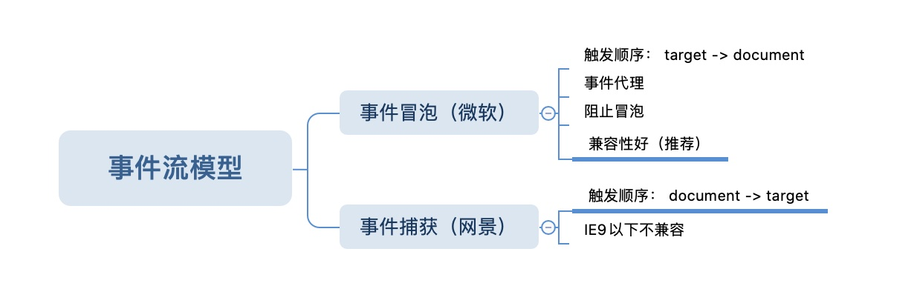

# 【每日一题】 js事件模型——捕获和冒泡

**【题目】**：点击“click me”，输出什么？

```html
<body>
    <div class="container">
        <div id="outer">
            <div id="inner">click me</div>
        </div>
    </div>
    <script>
        var $outer = document.getElementById('outer');
        var $inner = document.getElementById('inner');

        $inner.addEventListener('click', () => {console.log('a')}, true);
        $outer.addEventListener('click', () => {console.log('b')});
        $inner.addEventListener('click', () => {console.log('c')}, false),
        $outer.addEventListener('click', () => {console.log('d')}, true)

    </script>
</body>

```

**【分析】**：

我们在练习里看到的，两个dom分别绑定的多个事件。那么，点击之后，哪个事件先触发，哪个事件后触发呢？为了解决页面中的事件流问题。网景和微软分别引入的事件捕获和事件冒泡的处理方式。

- 事件冒泡
  - 触发顺序：div.inner  -> div.outer ->  div.container -> body -> document  （由内到外）

- 事件捕获
  -  触发顺序：document -> body -> div.container -> div.outer -> div.inner  （由外到内）


**【题解】**


```js
// output
dacb
```


**【记忆】**

- 优先级： 捕获 > 冒泡


**【结构】**



【扩展】

