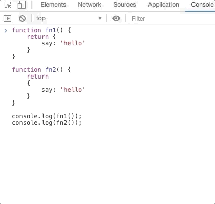

# 【每日一题】函数return不迷茫

**【题目】**

```js
function fn1() {
	return {
        say: 'hello'
	}
}

function fn2() {
    return 
    {
        say: 'hello'
    }
}

console.log(fn1()); 
console.log(fn2());

```

**【分析】**

- 函数通过 return 返回数据；
- return 执行完毕，后续代码停止执行；
- return 和 需要返回的数据开头， 需要保持在同一行，否则会被忽略，正如：函数fn2中return会自动加“;” ，并且结束该行，不再继续向下执行；

**【题解】**



```js
// output
{say: 'hello'};
undefined;
```

**【记忆】**

- javascript中分号在技术上是可选。尽管忽略它通常是非常糟糕的形式；
- 遇到return中的语句的行，没有其他内容时，会立即在return 语句后边自动插入分号。