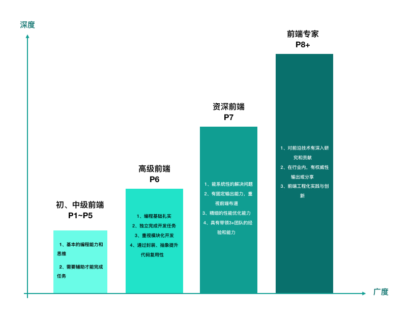

# 【每日一题】Job Model，前端段位简析

**【题目】**

> 标签：`开放性`、`技术常识`、`定位`

```js

// 请简述前端能力模型，并分析自己现在所处的阶段？

```

**【分析】**

“知己知彼，方能百战不殆”。

无论是在生活上还是在职场中，都应该对自己有一个清晰的定位。

清晰的定位

1. 知道能做什么，不做什么！
2. 先做什么，后做什么！
3. 争取什么，舍去什么！

总之，清晰的定位，可以帮我们明确目标，找准方向。

对于前端，不同公司有不同的 Job Model，我们需要选定一个或几个，综合的去评估自己，学会借假修真，形成自己的 **能力模型**。找到自己的定位。

**<u>前端能力三角模型</u>**



```js
// output
{say: 'hello'};
undefined;
```

**【记忆】**

- javascript中分号在技术上是可选。尽管忽略它通常是非常糟糕的形式；
- 遇到return中的语句的行，没有其他内容时，会立即在return 语句后边自动插入分号。